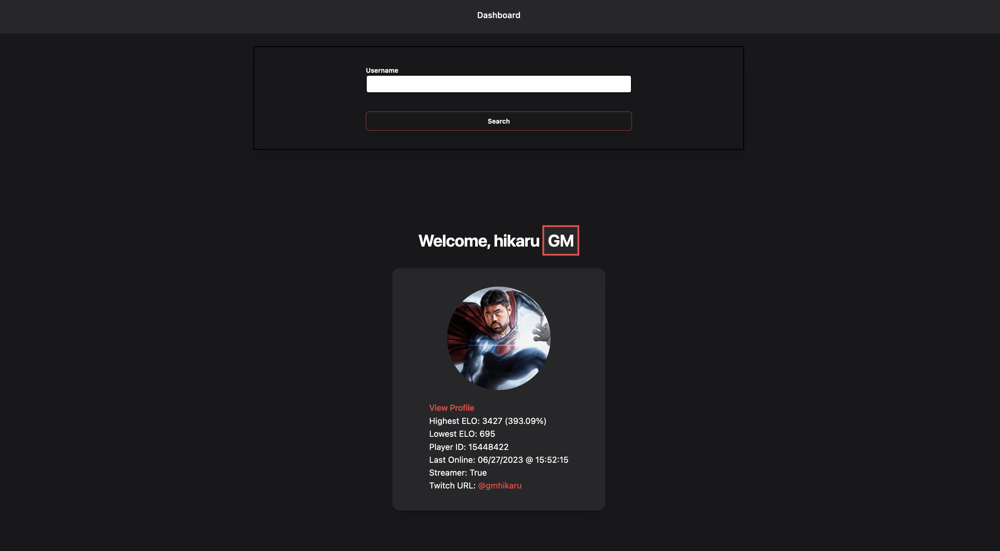

# Chess.com Dashboard

View information about anyone on chess.com using this Flask web app. All you have to do is search for the username of the person you want to find in the input

You can view the published web application here: https://chess-dashboard-flask.vercel.app

## Preview

*Zoomed out for a better preview*



The project currently contains the following information:

- Username
- Player ID
- Link to Profile (chess.com)
- Highest & Lowest ELO (+ percentage of growth/difference)
- Last Online
- Title
- Streamer & Twitch URL

## Usage

If you want to contribute to the project or just build the web app locally, I've added some instructions below

Make sure you have all the proper tools installed:

```bash
pip install -r requirements.txt
```

Now just run the following command to start the dashboard on your localhost (`localhost:5000`):

```bash
flask run
```

## Why?

I recently learned that chess.com has an API and wanted to mess around with it. Feel free to open a PR if you have improvements or submit an issue if something is broken. The project still needs some improvements on the technical side, but should work in most cases
